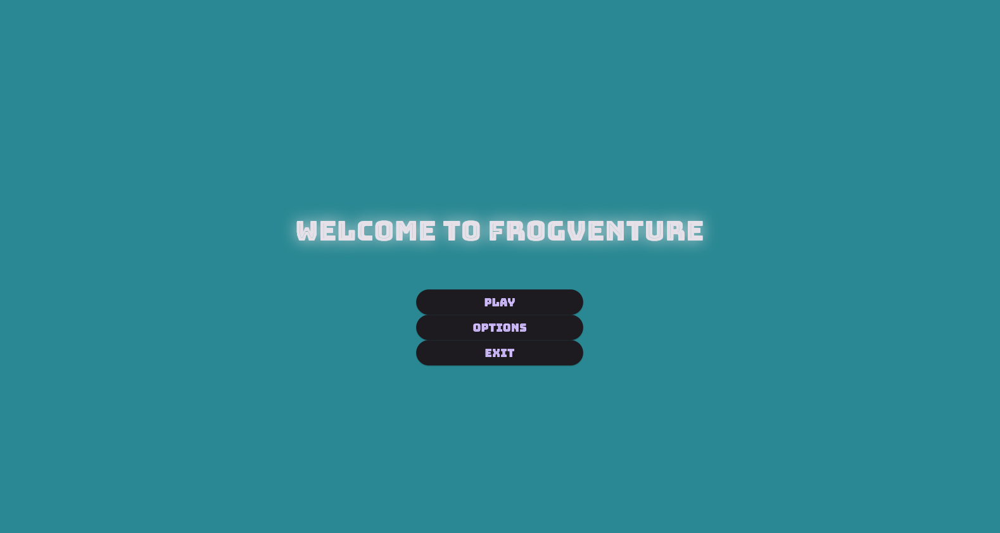
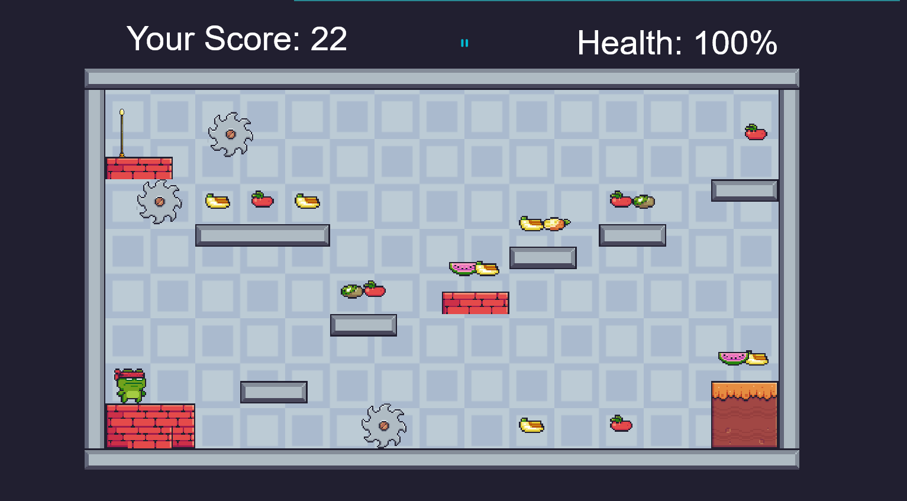
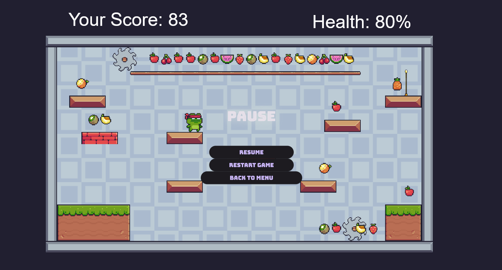

# Frogventure

A fun adventure platformer game built with Flutter and Flame.

## Features

- Play as a frog character
- Collect fruits
- Avoid obstacles and enemies
- Reach checkpoints to level up
- Sound effects and animations

## Getting Started

### Prerequisites

- [Flutter SDK](https://flutter.dev/docs/get-started/install)
- Git

### Running the Game

1. Clone the repository:
   ```
   git clone https://github.com/Epiti/FrogAdventure_Game
   cd adventure_game
   ```

2. Get dependencies:
   ```
   flutter pub get
   ```

3. Run the game:
   ```
   flutter run
   ```
   Select your target device (Windows, Chrome, etc.) when prompted.

## Controls

- **Arrow keys / A/D:** Move left/right
- **Space:** Jump

## Screenshots






## License

MIT

---

